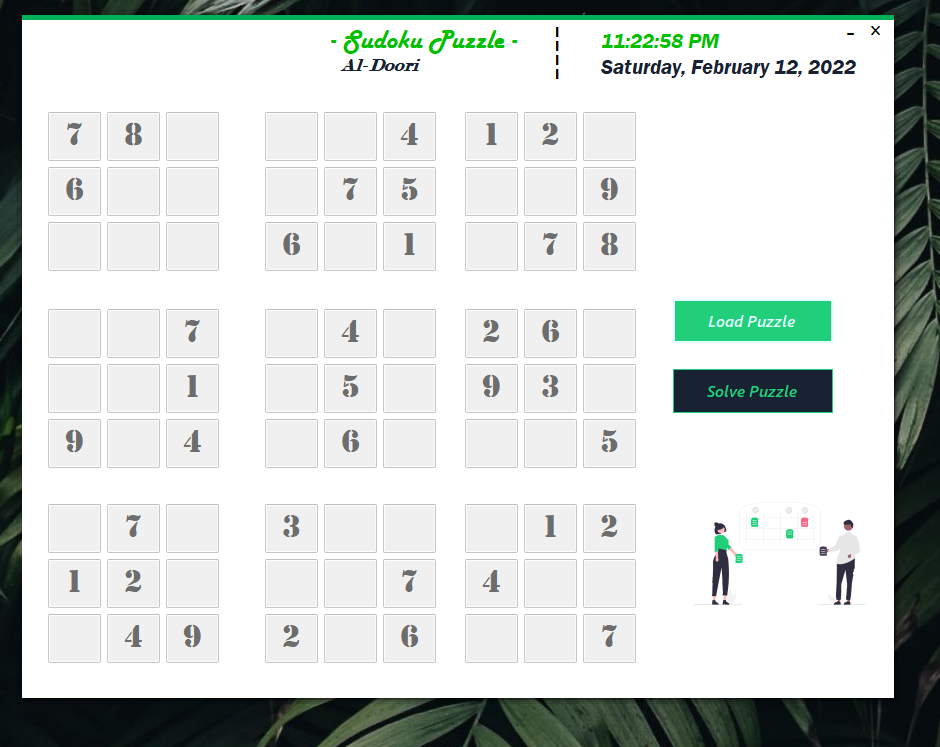
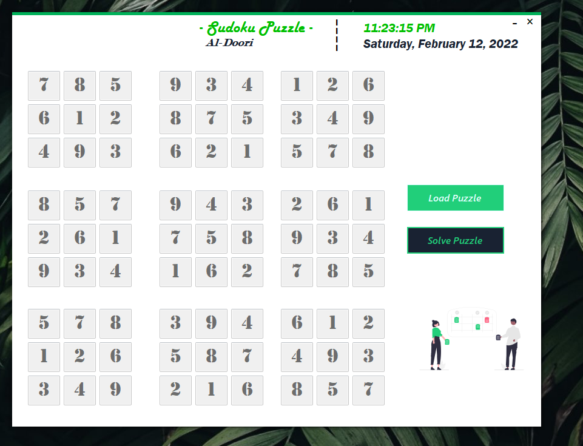

#SudokuPuzzleSolver

### Description of the App:
I was asked to code a Windows form app that solves the Sudoku Puzzle.
In Other word it is C# Windows Form Application that solves the Sudoku Puzzle using the backtrack algorithm.

* **Description of the main functionality:**
  * Uploading a sudoku puzzle txt file (9 x 9)
  * Solve the puzzle in a small amount of time using Backtrack algorithm instead of naive algorithm
  * Greate time complexity because we are avoiding the worst case of naive algroithm which is 9^81 (all possible solutions)
  
* **What is used in the app ? **
  * Simple OOP Principle as Services for solving the Puzzle
  * Concept of Dependency injection between the Form and Services  
  * .NET Windows Form
  * MetroModernUI Library for nice UI  
  
  
* **Condtions for a proprer solution:**
  * Upload a file from the puzzl files where:
 	 * Empty spaces (puzzle square) represtented by 0  
  	 * each 9 numbers in one line represent a row
  	 * we should have 9 lines (each line contain 9 numbers) (so we get 9 x 9)
  * Direct Executable file is inside the bin folder in the source code or at the root of the folder 
  
* **Screenshot of the internal app after building:**
</img>
</img>
